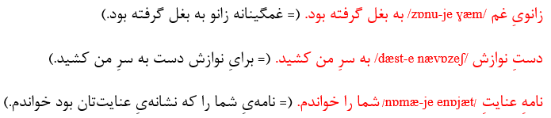

# Kasreh Ezafeh (Genitive Conjunction /e/) in Persian Language
 

## Persian genitive phrases
According to [this source](https://www.dastur.info/persian-grammar/10-attributes-and-attribution/#bb), in Persian language, Genitive is a kind of phrase syntax that sets two constituents in a hierarchical relationship (normally using the enclitical conjunction /-e/).

The superordinate constituent is called the nucleus, which is determined semantically by the second constituent, the modifier. The modifier is a special form of attribute:

Genitive phrases are normally endocentric, which means that the nucleus (or the modifier) is the reference of the genitive phrase. For example, /bærg-e ʧenɒr/ برگِ چنار is a determining of /bærg/ برگ, and /mɒh-e ordibeheʃt/ ماهِ اردیبهشت a specification of /mɒh/ ماه.

Nevertheless, there are some exocentric qualitative genitive phrases in which neither the nucleus nor the modifier is the reference. This occurence can be noted in the following sentences:

کارگران دستِ خالی از اتاقِ رییس بیرون آمدند.

راه درازست و ما پایِ پیاده.

In these examples, /dæst-e xɒli/ دستِ خالی is neither /dæst/ دست nor /xɒli/ خالی, and /pɒ-je piɒdæ/ پایِ پیاده is neither /pɒ/ پا nor /piɒdæ/ پیاده.

### Classifications of Genitive
The genitive can be classified in Persian as follows:

1. <strong>Qualitative Genitive</strong>: In the qualitative genitive, the modifier describes the nucleus. The qualitative genitive phrase and its nucleus are normally noun phrases, while the modifier is normally an adjectival phrase:  

  

2. <strong>Substantial Genitive</strong>: In the substantial genitive, the modifier identifies the material of which the nucleus is made up. In Persian, the substantial genitive is always endocentric. A substantial genitive phrase (like its nucleus and modifier) is a noun phrases:  

  

3. <strong>Explicative Genitive</strong>: In the explicative genitive, the nucleus represents the class of the modifier. In Persian, the explicative genitive is always endocentric. A explicative genitive phrase (like its nucleus and modifier) is a noun phrase:  

  

4. <strong>Possessive Genitive</strong>:In the possessive genitive, the nucleus belongs or appertains to the modifier. In Persian, the possessive genitive is always endocentric. The nucleus and modifier of the possessive genitive (like the genitive phrase itself) are normally noun phrases:  

  
5. <strong>Comitative Genitive</strong>:n the comitative genitive, the modifier identifies a process, which accompanies the nucleus. In Persian, the comitative genitive is always endocentric and used syndetical. The comitative genitive phrase (like its nucleus and modifier) is a noun phrase in the singular:  

  

